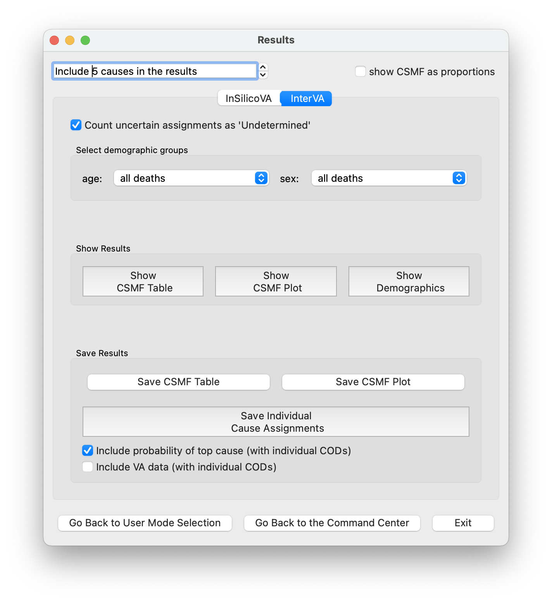

#################
Customizable Mode
#################

This mode in the openVA App includes two windows -- Command Center and Results -- where you can do the following

* **Command Center Window**

    + :ref:`set working directory <cust_step1>`

    + :ref:`load and prepare your VA data <cust_step2>`

    + :ref:`running the algorithms (with user-selected options) <cust_step3>`

       - :ref:`InSilicoVA<cust_step3_1>`

       - :ref:`InterVA<cust_step3_2>`

* **Results Window**

    + :ref:`view and save results <cust_step4>`

These are all described below as a series of steps.  To access this mode, simply click the "Customizable" button in the
initial openVA App window.

.. _cust_step1:

Step 1: Set Working Directory
=============================

The openVA App has several features allowing you to load or save files.  It can be useful to set a working directory,
which is a folder on you computer where the app will open as the default location for opening or saving files.  You can
set the working directory using the menu bar: `File` -> `Set working directory`.  In the new window that opens, go to
the folder that you would like to use as the working directory, click on it, and then click `Open`.  Although this
step is included in the description of the Command Center, the `Set working directory` menu item is accessible from any
window.

.. _cust_step2:

Step 2: Load and Prepare Data
=============================

After clicking the "Customizable" button on the initial openVA App window, you will be presented with the
"Command Center" window where you can process your VA data (in the "Data" panel on the left) and run the algorithms
with selected options (in the "Algorithms" panel on the right).  This window also allows you to save output from the
data processing steps.

2.1 Load (and Edit) Data
------------------------

You can process your VA data with the tools appearing in the "Data" panel on the left side of the "Command Center"
window.  At the top there is a button labeled "Load Data (.csv)". Here you can load a comma-separated values (CSV) file
containing VA data into the openVA App.  This App is designed to work with CSV exports from an
`ODK Central Server <https://docs.getodk.org/central-intro>`_. Clicking the "Load Data (.csv)" button will open a new
window in which you can navigate your computer's folders to find your VA data file.  Once you have located your CSV
file, select the file by clicking on it, and then click on the Open button.  The "Command Center" window should
now display a message that your data have been loaded, along with the name of the CSV file, and the number of deaths
included in your VA data.  If there is a problem (e.g., the file is corrupt or empty), then a message will appear
stating that the openVA App is unable to process the data file.  In this case, check to make sure you can open the CSV
file in a spreadsheet program and that the file is not empty.

Just below the button for loading data is the "Edit Data" button, which will open a new window displaying the conents
of your data.  In this "Edit Data" window, you can explore your data by searching for and sorting the values.  Also,
clicking the "Editable Header Fields (Column Names)" or "Editable Row Data" will allow you to make changes to your
data.  If changes are made, you can click the "Save Data" button which will prompt you for you name and allow you to
save the data as a new CSV file (with the name you entered included in the file name).  Note that these changes will
also be saved in the working data file that the openVA App will use when running the algorithms, but the original data
file will not be effected, unless you save the new file with the same file name as the original CSV file.

2.2: Select ID
--------------

After loading valid VA data, you can select the column that contains the ID so that you can locate VA records when
looking at the results.  In the box under the label "Select ID column in data", click on the arrows to display a list
of the column names in the CSV data file.  Scroll to the column name that you would like to use as the ID for the
individual VA records and click on the name.  In a later step, you will be able to run an algorithm and save the
assigned causes as a CSV file.  This file will include the ID column you selected to help you identify the VA records.
The default option (which appears after the data file is loaded) is "no ID column", which will simply use integers 1,
2, 3, ... for the ID.

2.3: Data Format
----------------

As of now, the openVA App is only able to process VA data collected using the 2016 WHO VA instrument,
and thus this is the only option.  When the InterVA and InSilicoVA algorithms have been updated to use
data collected with the 2022 WHO VA instrument, the openVA App will also be updated.

2.4: Convert Data to openVA Format
----------------------------------

At the bottom of the Data panel, you will see two buttons with the labels "Run pyCrossVA" and "Save pyCrossVA Data (.csv)".
Clicking on the "Run pyCrossVA" button will start the process of converting the data from the ODK format to the format
used by the algorithms (for more information about pyCrossVA, see the :ref:`FAQ page<faq_pycrossva>`). Since the openVA
App expects users to load a CSV data file exported from ODK Central, you must process your data with pyCrossVA before
you can assign causes of death.  If the data are formatted as expected, a new window will pop up with the message
"Data successfully converted to openVA format", at which point you can proceed to running the algorithms with your preferred
options.  Otherwise, the window will display the message produced by pyCrossVA concerning missing columns in your data
file or other problems with the data format.  If you would like to examine the new data set that pyCrossVA creates, you
can click the "Save pyCrossVA Data (.csv)" button that allows you to save the transformed data set as a CSV file.

.. _cust_step3:

Step 3: Run the Algorithm with Options
======================================

The openVA App offers COD assignment using either the InSilicoVA or InterVA.  Selecting options and running both
algorithms can be done from the "Command Center" window in the "Algorithms" panel on the right.

.. _cust_step3_1:

InSilicoVA
----------

**Please note that your data file must include at least valid 100 deaths to use the InSilicoVA algorithm.  VA records
that fail the data checks (e.g., have missing data for age or sex) are removed and do not count toward the 100 record
threshold.** [#]_ If the CSV data file that you loaded includes less than one hundred records, clicking on the InSilicoVA
button will produce a message stating that "InSilicoVA is unavailable.  At least 100 deaths are needed for reliable results.
(InterVA is available.)"

Controls for the InSilicoVA algorithm are located at the top of the "Algorithms" panel on the right side of the
"Command Center" window.  There are four options which are accessible by clicking on the "Set Options" button.  Doing so
will produce a new window (entitled "InSilicoVA Options") with the following controls: (1) Number of Iterations,
(2) Automatically increase chain length until convergence, (3) Jump Scale, and (4) Set Seed.

1. **Number of Iterations** - InSilicoVA obtains results by making draws from a distribution.  Increasing the number of
draws helps to improve the quality of the results.  Moving the slider for the "Number of Iterations" to the right will
(towards larger values) will increase the number of draws that the InSilicoVA will make, and thus increase the amount of
time it takes for algorithm to finish assignments CODs.

2. **Automatically increase chain length until convergence** -  After InSilicoVA makes the specified number of draws
(determined by the value for the "Number of Iterations"), it checks the checks the quality of the sample (i.e., the
collection of draws taken thus far) -- this is referred to as checking for convergence.  Checking the box to
"Automatically increase the chain length until convergence" will cause InSilicoVA to continue sampling for another
N draws (where N is the value for the number of iterations).  If convergence has not been reached by this point, the
algorithm will continue sampling for another 2*N draws.  This options helps ensure the quality of the results obtained
by InSilicoVA.

3. **Jump Scale** - This option helps tune or calibrate the sampling procedure employed by InSilicoVA.  At the current
stage of development, the openVA App does not provide enough information to make use of the slider for the "Jump Scale",
and it is simply a place-holder for coming features.  More specifically, while InSilicoVA is running it gives continual
feedback about its sampling procedure.  This information is not yet provided to the user by the openVA App, and thus it
is not possible to optimize the sampling procedure by adjusting the value value of the "Jump Scale".  However, we will
make this feature available in a future versions of the App.

4. **Set Seed** - Sampling from a distribution requires generating random numbers (or pseudo-random, i.e., pretty close
to random).  If the same value for the "Seed" is used, then InSilicoVA will generate the same sequence of random numbers
and the results will be identical across runs (assuming the other options are held constant).  Setting a different seed
will produce slight variation in the results, though the substantive findings and conclusions will be the same.

Once the desired options have been chosen, you can start the InSilicoVA algorithm by clicking on the "Run InSilicoVA"
button.  This action will start the data consistency checks (for more information about this step, see the
:ref:`FAQ page<faq_data_consistency_checks>`) and the message below the InSilicoVA progress bar will change to
"preparing data".  Upon completion, the InSilicoVA algorithm will begin the sampling procedure, the progress bar will begin
moving forward, and the message will display ("Running InSilicoVA").  The progress bar counts to the "Number of Iterations"
option, and if the option "Automatically increase chain length until convergence" is chosen, then the progress bar may reset
up to two times depending on covergence (as indicated in the message appearing below the progress bar).  Depending on the
size of the data set, it may take a while for the InSilicoVA algorithm to finish -- a data set with 100 deaths takes around
12 minutes to process with InSilicoVA.  There is also a "Stop" button that will stop the InSilicoVA algorithm -- if stopped, the
algorithm will need to run through all of the steps from the beginning when restarted.

Once the results are ready, the message below the progress bar will indicate that the "InSilicoVA results are ready"
and you will be able to check the convergence of the algorithm and access the results from the data checks.  Clicking
on the "Check convergence" button will display a new window that lists the causes of death for which the algorithm did
not converge -- more specifically, this list only includes causes which account for at least 2% deaths (i.e., the
CSMF values is greater than 0.02).  Again, increasing the number of iterations will improve the chances that the
algorithm converges for the all of these causes.

Clicking on the "Save log from data checks" button will produce a new window where you can choose the location for
saving the log file from the data consistency check.

Clicking on the "Results" button, which will take you to a new window where you will be able to access the cause
of death results produced.  Clicking the "Go Back to User Mode Selection" button will return to the window where you can select the
mode, and you can click the "Exit" button to close the openVA App.

.. _cust_step3_2:

InterVA
-------

Clicking on the "Set Options" button in the "InterVA" panel produces a new window where you can choose the InterVA input
parameters.  There are two parameters characterizing the prevalence of HIV/AIDS and malaria deaths.  The possible values for these
input parameters are: "high", "low", and "very low".  According the User Guide for the original InterVA5 software,
these levels roughly correspond to the cause accounting for 1.0% of all deaths (high), 0.10% (low), and 0.01% (very
low).  The following guidance is quoted directly from the InterVA5 User Guide (which can be obtained from the Peter Byass
`InterVA-5 GitHub repository <https://github.com/peterbyass/InterVA-5/tree/master/Download%20of%20InterVA-5%20software>`_)::

    Examples of appropriate responses might be low malaria, low HIV for many Asian locations; high malaria, high
    HIV for many East African locations; high malaria, low HIV for some West African locations, etc.  The "very low"
    setting should be used for locations where deaths from malaria or HIV are known to be extremely rare.  The
    choices for these settings do not directly determine the cause of death, but conceptually they are similar to a
    physician knowing that (s)he is working in a high or low malaria or HIV population, irrespective of the details of
    a specific case currently under consideration.  (p. 7)

Clicking the "Run InterVA" button will start the process of assigning CODs, which begins with the data consistency checks
(for more information about this step, see the :ref:`FAQ page<faq_data_consistency_checks>`) and changes the message
below the progress bar to "preparing data".  Upon completion, the App will start assigning CODs with InterVA and the
progress bar will start advancing (you will also see a message "Running InterVA.." below the progress bar).  Depending on the
size of the data set, it may take a while for the InterVA algorithm to finish -- a data set with 100 deaths takes a few seconds
to process with InterVA.  Clicking on the "Stop" button will stop the InterVA algorithm and all progress will be lost.  In other
words, starting the algorithm again will require going through the data consistency checks and starting the COD assignments from
the beginning.  Once the results are ready, the message below the progress bar will indicate that the "InterVA5 results are ready"
and you will be able to save the log file from the data checks by clicking on the "Save log from data checks" button.

Clicking on the "Results" button, which will take you to a new window where you will be able to access the cause
of death results produced.  Clicking the "Go Back to User Mode Selection" button will return to the window where you can
select the mode, and you can click the "Exit" button to close the openVA App.

.. _cust_step4:

Step 4: View and Save Results
=============================

In the "Results" window, there are several options for tailoring the COD results for both algorithms.  There is an
"InSilicoVA" tab and an "InterVA" tab near the top of the window.  On either tab, you are also able to view the CSMF
(cause-specific mortality fractions) results as a table or plot, as well as saving these results as a CSV or PDF file.
The age and sex distribution of the deaths can also be viewed as a table, and the individual cause assignments can be
saved as a CSV file.

Just above the algorithm tabs at the top of the "Results" window is a box where you can choose the number of causes to
include when viewing or saving the COD results.  The default is "Include 5 causes in the results", but clicking the up
arrow at the side of the box will add more causes to the summaries, while clicking the down arrow includes fewer causes.

When exploring results from the InterVA algorithm, it is also possible to exclude "Undetermined" as a cause of death
by unchecking the box next to the label "Count uncertain assignments as 'Undetermined'" -- simply check or uncheck this
option by clicking on the box.  Since InSilicoVA does not assign "Undetermined" as a COD, this option is not available
when exploring InSilicoVA results.

Near the top of the window is a panel labeled "Select demographic groups", with options for limiting the results to a
specific age or sex group.  The default for both demographic indicators is to include "all deaths".  However, clicking
on the arrows at the side of each box will present options to restrict the results to adults, children or neonates.
Similarly, the results can also be set to only include either females or males.  Combinations are also possible (e.g.,
female children).

The middle panel of the Results window contains three buttons for viewing either the CSMF or a cross tabulation of
the deaths by the sex and age categories (described just above).  Clicking on any of these three buttons will produce
a new window with the chosen results (for the selected demographic options and number of causes).  Note that different
color schemes can be selected for the plot from the menu bar: `Plot` -> `Choose color scheme...`.  It is also
possible to change the data presented in the demographic table shown by clicking on the "Show demographics" button,
e.g., you can the totals for the rows and columns, or change the cell values so that they are a percentage (or
proportion) of the row or column totals.

The CSMF results produced by InSilicoVA include different information from what is made available by InterVA.  More
specifically, InSilicoVA estimates the uncertainty around the CSMF values and provides ranges of the most
likely values.  In the CSMF plot from InSilicoVA, there is a 95% probability that CSMF value in the *population* [#]_ is
included in the range covered by the bar; the dot in the middle of the bar indicates the median value (so there is a
50% chance that the true value is below the dot).  In the CSMF table, the mean value is included in the column with the
label CSMF, the standard error is listed in the next column, and the final three columns show the 2.5th percentile
("lower"), the median, and the 97.5th (percentile).  These last three columns are the values used to create the CSMF
plot for InSilicoVA.  On the other hand, InterVA does not include uncertainty, so there is only a single value for
the CSMF for each cause of death.

The bottom panel on the "InterVA" tab, labeled "Save Results", contains three buttons for saving the CSMF results as
either a table (in CSV file) or a plot (in a PDF file), as well as a button for saving the individual cause assignments
as a CSV file.  Again, the options for selecting a demographic group are reflected in the saved results.  For example,
if the "male" and "neonate" options are selected, then the saved files will contain the CSMF for male neonates, or the
individual causes assigned only to members of this group.  When saving the individual cause assignments, you can merge
the original VA data (loaded into the app in a Step 2) with the CSV file by first checking the box labeled "Include VA
data (with individual CODs)" and then clicking the "Save Individual Cause Assignments" button.  It is also possible
to include either the propensities (with InterVA) or the probabilities (with InSilicoVA) of each cause of death in the
saved CSV file by checking the box next to the label "Include probability of top cause (with individual CODs)".  With
InterVA, only the top 3 causes can be included.

The bottom panel of the "InSilicoVA" tab includes a fourth button, "Save All Cause Assignments", which allows you to
save the probability of each cause of death for all valid VA records.

Finally, the navigation buttons at the bottom allow you to return to the previous windows, or to close the openVA App with
the "Exit" button.

.. rubric:: Footnotes

.. [#]  While it is possible to run InSilicoVA with fewer deaths, our experience suggests that the results are more
        reliable with larger sample sizes.  In our experimentation with VA data (with external causes assigned), 100
        deaths provided to be a reasonable threshold for obtaining reliable results.
.. [#]  VA data include only a fraction of all the deaths that have occurred in the population.  InSilicoVA uses the
        information in the data set to estimate the CSMF of the population where the verbal autopsies are collected.
        Since the data do not include all deaths, InSilicoVA is uncertain about what the true CSMF values are in the
        population.  However, the more deaths that are included in the data set, the more information InSilicoVA has and
        the less uncertainty (i.e., the smaller the bars in the CSMF plot).

.. hlist::
   :columns: 4

   * :doc:`Home <index>`
   * :doc:`One-Click (Wizard) <wizard>`
   * :doc:`Vignette <vignette>`
   * :doc:`FAQ <faq>`
