####################################
Vignette: analysis with example data
####################################

This help page walks through an example session of the One-Click Wizard mode.  Here we will use the InterVA5 algorithm
to assign causes of death to the example data set included with the openVA App.

Step 1: Set Working Directory
=============================

The openVA App has several features allowing you to load or save files.  It can be useful to set a working directory,
which is a folder on you computer where the app will open as the default location for opening or saving files.  You can
set the working directory using the menu bar: `File` -> `Set working directory`.  In the new window that opens, go to
the folder that you would like to use as the working directory, click on it, and then click `Open`.

.. image:: img/vignette_load_data.png

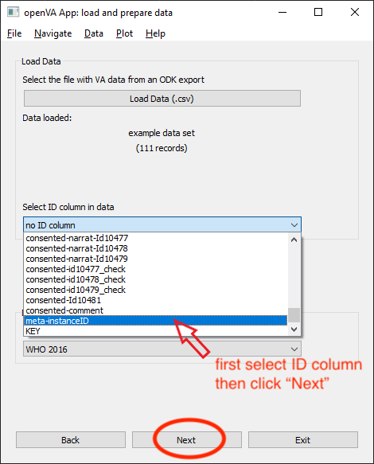

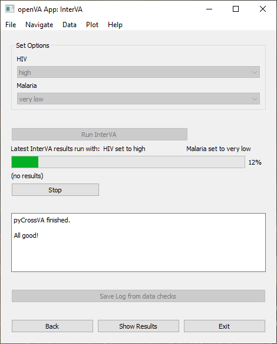

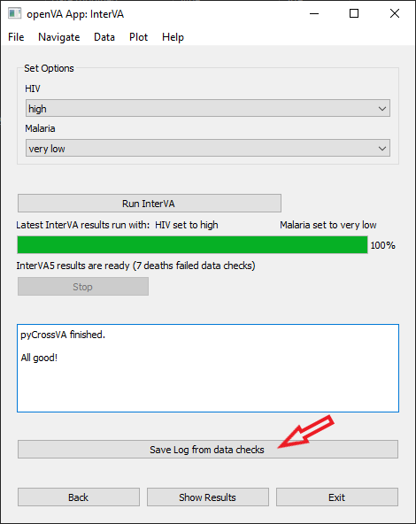

.. image:: img/vignette_interva_log.png

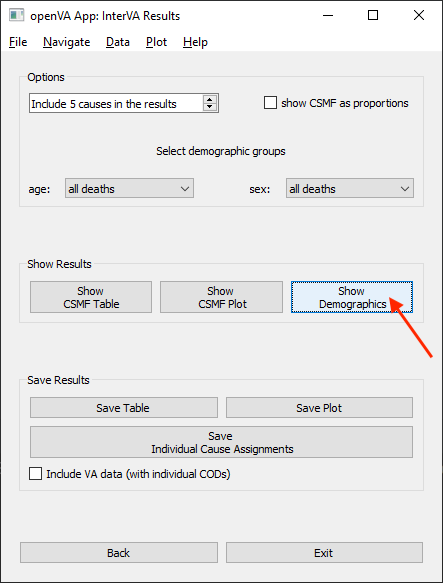

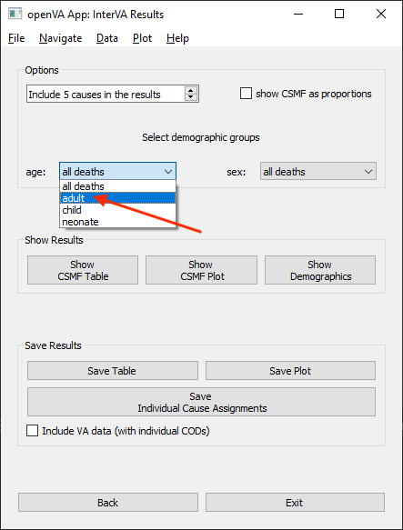

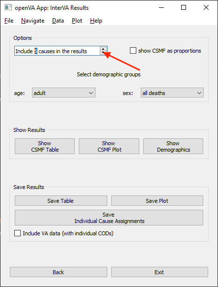

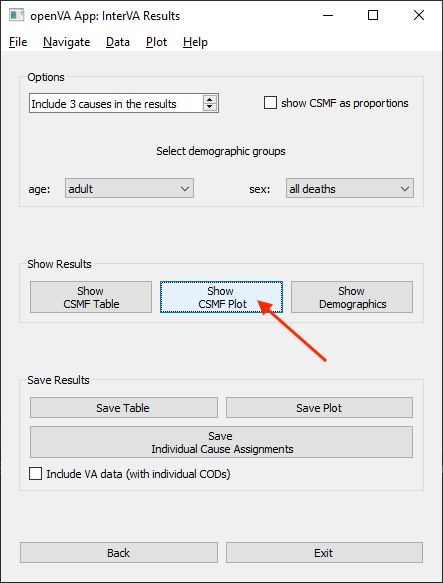

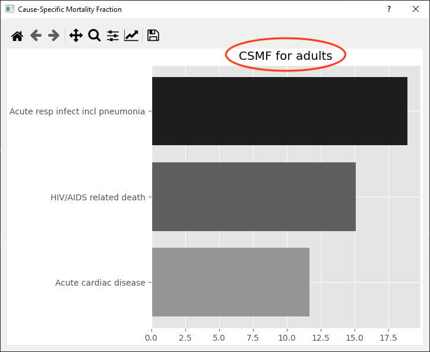

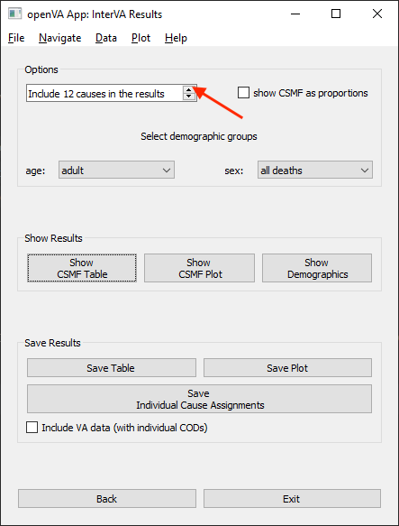

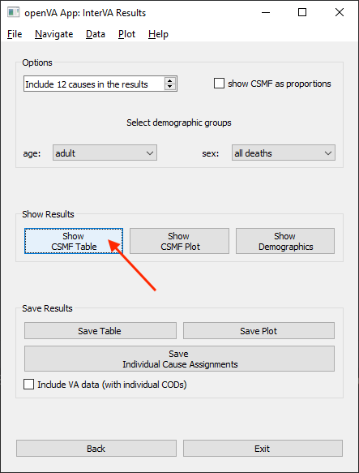

.. image:: img/vignette_interva_tab_with_undet.png

.. image:: img/vignette_interva_check_no_undet.png

.. image:: img/vignette_interva_tab_no_undet.png

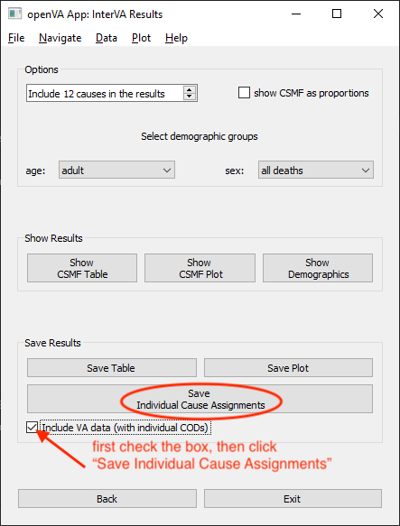

===================  ==================================  =================================  ================
:doc:`Home <index>`  :doc:`One-Click (Wizard) <wizard>`  :doc:`Customizable Mode <custom>`  :doc:`FAQ <faq>`
===================  ==================================  =================================  ================
