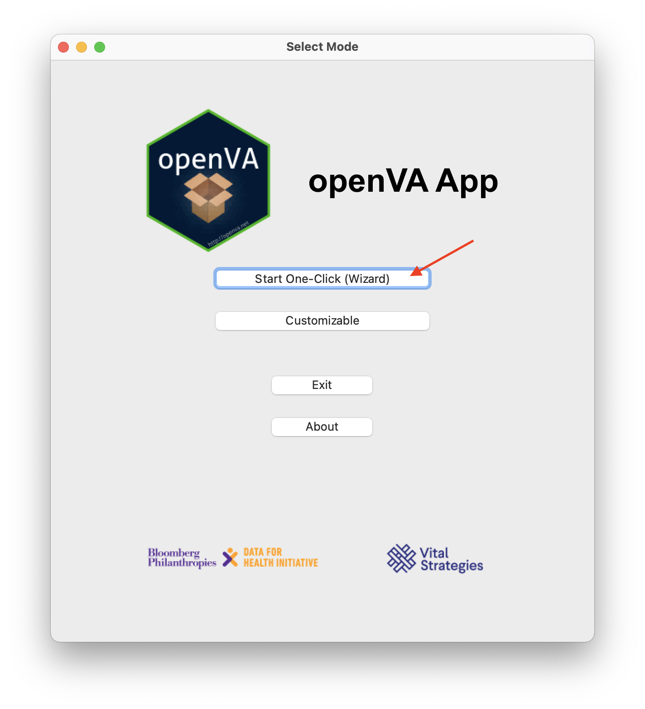

One-Click Wizard
================

This mode in the openVA App will guide you through a sequence of windows where you will
walk through the following steps (in order):

1. :ref:`load and prepare the your VA data <wiz_step1>`
2. :ref:`select the algorithm you wish to use for assigning CoDs <wiz_step2>`
3. :ref:`running the algorithm (with user-selected options) <wiz_step3>`
4. :ref:`accessing the results <wiz_step4>`

Each of these steps is described below.  To access this mode, simply click the
"Start One-Click (Wizard)" button in the initial openVA App window

.. _wiz_step1:

Step1: Load and Prepare Data
~~~~~~~~~~~~~~~~~~~~~~~~~~~~

After clicking the "Start One-Click (Wizard)" button on the initial openVA App window, you will
be presented with the "load and prepare data" window where you can: **(a)** load your VA data into the App;
**(b)** select the column in the data file with the ID for the autopsy records; and **(c)** select the version
of the WHO VA instrument that was used to collect the VA data.

.. image:: img/wiz_load_data.png

(a) Here you can load a comma-separated values (CSV) file containing VA data into the openVA App.
This mode is designed to work with CSV exports from an `ODK Central Server <https://docs.getodk.org/central-intro>`_.
Clicking the "Load Data (.csv)" button will open a new window in which you can navigate your computer's
folders to find your VA data file.  Once you have located your CSV file, select the file by clicking on it,
and then click on the Open button.  The "load and prepare data" window should now display a message that your
data have been loaded, along with the name of the CSV file, and the number of deaths included in your VA data.
If there is a problem (e.g., the file is corrupt or empty), then a message will appear stating that the openVA
App is unable to to load the data file.  In this case, check to make sure you can open the CSV file in a spreadsheet
program and that the file is not empty.

(b) Click here and select the column name.  This ID will be included with the individual cause assignments
that will be available for saving in CSV format in a subsequent window.

(c) As of now, the openVA App is only able to process VA data collected using the 2016 WHO VA instrument,
and thus this is the only option.  When the InterVA and InSilicoVA algorithms have been updated to use
data collected with the 2022 WHO VA instrument, the openVA App will also be updated.

.. _wiz_step2:

Step 2: Select an Algorithm
~~~~~~~~~~~~~~~~~~~~~~~~~~~

.. _wiz_step3:

Step3: Run the Algorithm with Options
~~~~~~~~~~~~~~~~~~~~~~~~~~~~~~~~~~~~~

.. _wiz_step4:

Step 4: Access Results
~~~~~~~~~~~~~~~~~~~~~~

:doc:`Home <index>`  :doc:`Customizable Mode <custom>`
