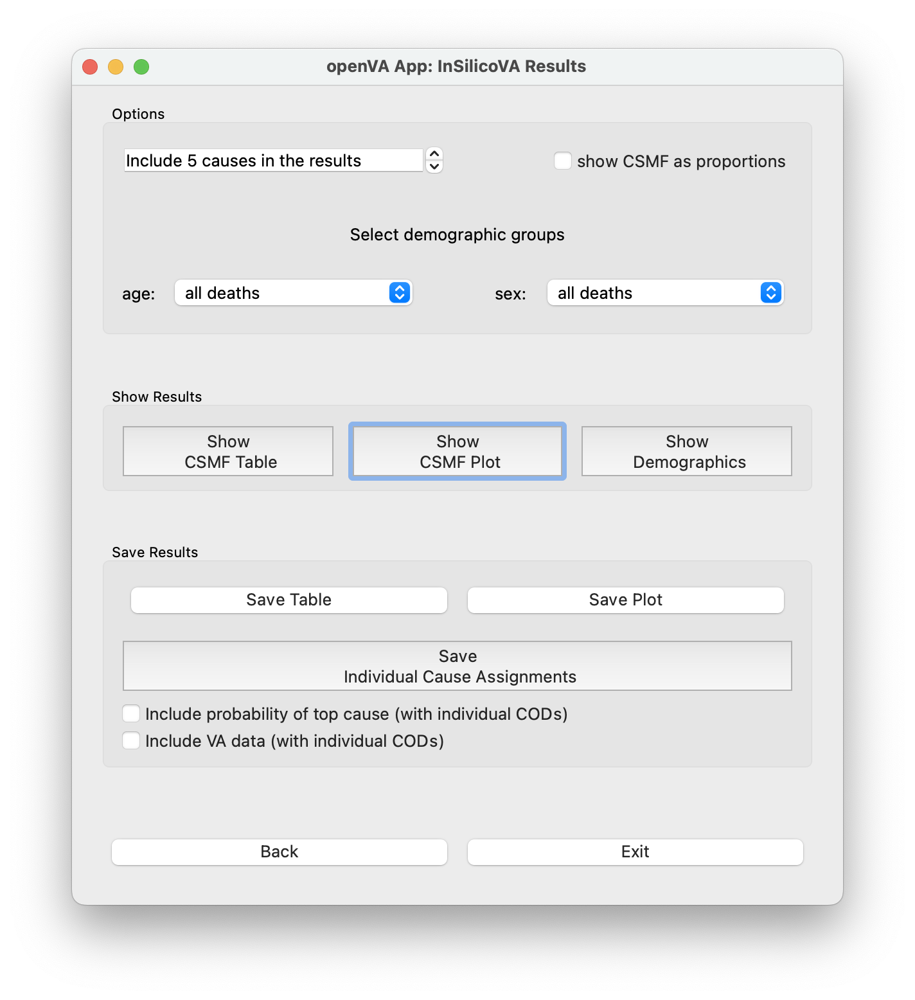

################
One-Click Wizard
################

This mode in the openVA App will guide you through a sequence of windows where you will
walk through the following steps:

1. :ref:`set working directory <wiz_step1>`
2. :ref:`load and prepare your VA data <wiz_step2>`
3. :ref:`select the algorithm you wish to use for assigning CoDs <wiz_step3>`
4. :ref:`running the algorithm (with user-selected options) <wiz_step4>`

   * :ref:`InSilicoVA<wiz_step4_1>`

   * :ref:`InterVA<wiz_step4_2>`

5. :ref:`view and save results <wiz_step5>`

Each of these steps is described below.  To access this mode, simply click the "Start One-Click (Wizard)" button in the
initial openVA App window.

.. image:: img/select_wizard.png

.. _wiz_step1:

Step 1: Set Working Directory
=============================

The openVA App has several features allowing you to load or save files.  It can be useful to set a working directory,
which is a folder on you computer where the app will open as the default location for opening or saving files.  You can
set the working directory using the menu bar: `File` -> `Set working directory`.  In the new window that opens, go to
the folder that you would like to use as the working directory, click on it, and then click `Open`.

.. _wiz_step2:

Step 2: Load and Prepare Data
=============================

After clicking the "Start One-Click (Wizard)" button on the initial openVA App window, you will
be presented with the "load and prepare data" window where you can: **(a)** load your VA data into the App;
**(b)** select the column in the data file with the ID for the autopsy records; and **(c)** select the version
of the WHO VA instrument that was used to collect the VA data.

.. image:: img/wiz_load_data.png

(a) Here you can load a comma-separated values (CSV) file containing VA data into the openVA App.
This App is designed to work with CSV exports from an `ODK Central Server <https://docs.getodk.org/central-intro>`_.
Clicking the "Load Data (.csv)" button will open a new window in which you can navigate your computer's
folders to find your VA data file.  Once you have located your CSV file, select the file by clicking on it,
and then click on the Open button.  The "load and prepare data" window should now display a message that your
data have been loaded, along with the name of the CSV file, and the number of deaths included in your VA data.
If there is a problem (e.g., the file is corrupt or empty), then a message will appear stating that the openVA
App is unable to to load the data file.  In this case, check to make sure you can open the CSV file in a spreadsheet
program and that the file is not empty.

(b) After loading valid VA data, you can select the column that contains the ID so that you can locate VA records when
looking at the results.  In the box under the label "Select ID column in data", click on the arrows to display a list
of the column names in the CSV data file.  Scroll to the column name that you would like to use as the ID for the
individual VA records and click on the name.  In a later step, you will be able to run an algorithm and save the
assigned causes as a CSV file.  This file will include the ID column you selected to help you identify the VA records.
The default option (which appears after the data file is loaded) is "no ID column", which will simply use integers 1,
2, 3, ... for the ID.

(c) As of now, the openVA App is only able to process VA data collected using the 2016 WHO VA instrument,
and thus this is the only option.  When the InterVA and InSilicoVA algorithms have been updated to use
data collected with the 2022 WHO VA instrument, the openVA App will also be updated.

Once you have loaded your data and chosen your ID column, click on the Next button to go to the next window where you
can select the algorithm you want to use to assign COD to your VA records.  Alternatively, you can click the
Back button to return to the window where you can select the mode (either One-Click Wizard mode, or the Customizable
mode).  Finally, you can click the Exit button to close the openVA App.

.. _wiz_step3:

Step 3: Select Algorithm
========================

The openVA App displays the "select algorithm" window after you advance from the "load and prepare data" window.  Simply
click on the InSilicoVA button to run this algorithm.  **Please note that your data file must include at least valid 100
deaths to use the InSilicoVA algorithm.  VA records that fail the data checks (e.g., have missing data for age or sex)
are removed and do not count toward the 100 record threshold.** [#]_ If the CSV data file that you loaded includes less
than one hundred records, clicking on the InSilicoVA button will produce a message stating that
"InSilicoVA is unavailable.  At least 100 deaths are needed for reliable results. (InterVA is available.)"

Alternatively, click on the "InterVA" button to use the InterVA5 algorithm to assign causes of death to the VA records.

.. image:: img/wiz_select_alg.png

Clicking on one of the algorithm buttons will switch the app to a new window where you will be able to run either
InSilicoVA algorithm or the InterVA algorithm.  Alternatively, you can click the Back button to return to the window
where you can load and prepare your data; or you can click the Exit button to close the openVA App.

.. _wiz_step4:

Step 4: Run the Algorithm with Options
======================================

The openVA App offers COD assignment using either the InSilicoVA or InterVA algorithm.  In the One-Click Wizard mode,
each algorithm has its own window, which are described in turn.

.. _wiz_step4_1:

InSilicoVA
----------

The InSilicoVA window in the One-Click Wizard mode allows users choose the number of iterations and to start (and stop)
the algorithm.  There are also several features for monitoring the algorithm's progress, access information about the
data processing steps (pyCrossVA and the data consistency checks), and checking the convergence of the InSilicoVA
algorithm.

.. image:: img/wiz_run_insilicova.png

The default option for the number of iterations InSilicoVA will use is 4,000, which is displayed in the spinbox near
the top of the top of the window.  Clicking on the up arrow on the right-side of the spinbox will increase the number
of iterations in increments of 1,000.  It is also possible to click inside of the spinbox and use the keyboard to enter
the number of iterations within the accepted range (he minimum number of iterations in Wizard mode is 4,000 and the
maximum is 40,000.)  Increasing the number of iterations will help ensure that the algorithm will converge.

If data have been loaded (with at least 100 deaths included in the data file), clicking the "Run InSilicoVA"
button will start the process of assigning CODs.  This procedure includes 3 steps.  First, the app will convert the data
from the ODK format to the format expected by the algorithm. The results from this step will be displayed in the
box with the text "(pyCrossVA messages...)".  If certain columns are missing in the data file, the message will include
the names of these missing columns along with information about how they are used to prepare the data in the expected
format.  If the data include all of the necessary columns, then the message box will print "All good!" (for more
information about pyCrossVA, see the :ref:`FAQ page<faq_pycrossva>`).

In the second step, the app will run the data consistency checks (for more information about this step, see the
:ref:`FAQ page<faq_data_consistency_checks>`).  During these first two steps the openVA App will
display a "preparing data" message below the progress bar.  During the final step, the app will start the process of
assigning CODs and the progress bar will start advancing (you will also see a message "Running InSilicoVA.." below the
progress bar).  Depending on the size of the data set, it may take a while for the InSilicoVA algorithm to finish -- a
data set with 100 deaths takes around 12 minutes to process with InSilicoVA.  The progress bar may reset once or twice
as the InSilicoVA algorithm works towards convergence of its sampling procedure for obtaining results.  Finally, there
is a "Stop" button that will stop the InSilicoVA algorithm -- if stopped, the algorithm will need to run through all of
the steps from the beginning when restarted.

Once the results are ready, the message below the progress bar will indicate that the "InSilicoVA results are ready"
and you will be able to check the convergence of the algorithm and access the results from the data checks.  Clicking
on the "Check convergence" button will display a new window that lists the causes of death for which the algorithm did
not converge -- more specifically, this list only includes causes which account for at least 2% deaths (i.e., the
CSMF values is greater than 0.02).  Again, increasing the number of iterations will improve the chances that the
algorithm converges for the all of these causes.

Clicking on the "Save log from data checks" button will produce a new window where you can choose the location for
saving the log file from the data consistency check.

Clicking on the "Show Results" button, which will take you to a new window where you will be able to access the cause
of death results produced by InSilicoVA.

Finally, clicking the "Back" button will return to the window where you can select the algorithm, and you can click the
"Exit" button to close the openVA App.

.. _wiz_step4_2:

InterVA
-------

The InterVA window allows users so set the algorithm's input parameters, run (and stop) the algorithm, and access
information from the data processing steps, namely, pyCrossVA and the data consistency checks.

There are two parameters characterizing the prevalence of HIV/AIDS and malaria deaths.  The possible values for these
input parameters are: "high", "low", and "very low".  According the User Guide for the original InterVA5 software,
these levels roughly correspond to the cause accounting for 1.0% of all deaths (high), 0.10% (low), and 0.01% (very
low).  The following guidance is quoted directly from the InterVA5 User Guide (which can be obtained from the Peter Byass
`InterVA-5 GitHub repository <https://github.com/peterbyass/InterVA-5/tree/master/Download%20of%20InterVA-5%20software>`_)::

    Examples of appropriate responses might be low malaria, low HIV for many Asian locations; high malaria, high
    HIV for many East African locations; high malaria, low HIV for some West African locations, etc.  The "very low"
    setting should be used for locations where deaths from malaria or HIV are known to be extremely rare.  The
    choices for these settings do not directly determine the cause of death, but conceptually they are similar to a
    physician knowing that (s)he is working in a high or low malaria or HIV population, irrespective of the details of
    a specific case currently under consideration.  (p. 7)

If data have been loaded, clicking the "Run InterVA" button will start the process of assigning CODs.  This procedure
includes 3 steps.  First, the app will convert the data from the ODK format to the format expected by the algorithm.
The results from this step will be displayed in the box with the text "(pyCrossVA messages...)".  If certain columns are
missing in the data file, the message will include the names of these missing columns along with information about how
they are used to prepare the data in the expected format.  If the data include all of the necessary columns, then the
message box will print "All good!" (for more information about pyCrossVA, see the :ref:`FAQ page<faq_pycrossva>`)

In the second step, the app will run the data consistency checks (for more information about this step, see the
:ref:`FAQ page<faq_data_consistency_checks>`).  During the final step, the app will start the
process of assigning CODs and the progress bar will start advancing (you will also see a message "Running InterVA.."
below the progress bar with the values for the HIV and malaria parameters appearing above the progress bar).
Depending on the size of the data set, it may take a while for the InterVA algorithm to finish -- a
data set with 100 deaths takes a few seconds to process with InterVA.

Once the results are ready, the message below the progress bar will indicate that the "InterVA5 results are ready"
and you will be able to check the convergence of the algorithm and access the results from the data checks.
Clicking on the "Save log from data checks" button will produce a new window where you can choose the location for
saving the log file from the data consistency check.

Clicking on the "Show Results" button, which will take you to a new window where you will be able to access the cause
of death results produced by InterVA5.

Finally, clicking the "Back" button will return to the window where you can select the algorithm, and you can click the
"Exit" button to close the openVA App.

.. _wiz_step5:

Step 5: View and Save Results
=============================

In the results window, there are several options for tailoring the COD results from the chosen algorithm (note that the
algorithm name appears in the window's title).  You are also able to view the CSMF (cause-specific mortality fractions)
results as a table or plot, as well as saving these results as a CSV or PDF file.  The age and sex distribution of the
deaths can also be viewed as a table, and the individual cause assignments can be saved as a CSV file.

The options shown at the top of the Results window include a box where you can choose the number of causes to include
when viewing or saving the COD results.  The default is "Include 5 causes in the results", but clicking the up arrow
at the side of the box will add more causes to the summaries, while clicking the down arrow includes fewer causes.
Just below is a label "Select demographic groups", with options for limiting the results to a specific age or sex group.
The default for both demographic indicators is to include "all deaths".  However, clicking on the arrows at the side
of each box will present options to restrict the results to adults, children or neonates.  Similarly, the results
can also be set to only include either females or males.  Combinations are also possible (e.g., female children).

The middle panel of the Results window contains three buttons for viewing either the CSMF or a cross tabulation of
the deaths by the sex and age categories (described just above).  Clicking on any of these three buttons will produce
a new window with the chosen results (for the selected demographic options and number of causes).  Note that different
color schemes can be selected for the plot from the menu bar: `Plot` -> `Choose color scheme...`.  It is also
possible to change the data presented in the demographic table shown by clicking on the "Show demographics" button,
e.g., you can the totals for the rows and columns, or change the cell values so that they are a percentage (or
proportion) of the row or column totals.

The CSMF results produced by InSilicoVA include different information from what is made available by InterVA.  More
specifically, InSilicoVA estimates the uncertainty around the CSMF values and provides ranges of the most
likely values.  In the CSMF plot from InSilicoVA, there is a 95% probability that CSMF value in the *population* [#]_ is
included in the range covered by the bar; the dot in the middle of the bar indicates the median value (so there is a
50% chance that the true value is below the dot).  In the CSMF table, the mean value is included in the column with the
label CSMF, the standard error is listed in the next column, and the final three columns show the 2.5th percentile
("lower"), the median, and the 97.5th (percentile).  These last three columns are the values used to create the CSMF
plot for InSilicoVA.  On the other hand, InterVA does not include uncertainty, so there is only a single value for
the CSMF for each cause of death.

The bottom panel, labeled "Save Results", contains three buttons for saving the CSMF results as either a table (in CSV
file) or a plot (in a PDF file), as well as a button for saving the individual cause assignments as a CSV file.  Again,
the options for selecting a demographic group are reflected in the saved results.  For example, if the "male" and
"neonate" options are selected, then the saved files will contain the CSMF for male neonates, or the individual causes
assigned only to members of this group.  When saving the individual cause assignments, you can merge the original VA
data (loaded into the app in a Step 2) with the CSV file by first checking the box labeled
"Include VA data (with individual CODs)" and then clicking the "Save Individual Cause Assignments" button. It is also possible
to include either the propensities (with InterVA) or the probabilities (with InSilicoVA) of each cause of death in the
saved CSV file by checking the box next to the label "Include probability of top cause (with individual CODs)".  With InterVA,
only the top 3 causes can be included.

Finally, clicking the "Back" button will return to the window where you can run the selected algorithm, while clicking
the "Exit" button will close the openVA App.

.. rubric:: Footnotes

.. [#]  While it is possible to run InSilicoVA with fewer deaths, our experience suggests that the results are more
        reliable with larger sample sizes.  In our experimentation with VA data (with external causes assigned), 100
        deaths provided to be a reasonable threshold for obtaining reliable results.
.. [#]  VA data include only a fraction of all the deaths that have occurred in the population.  InSilicoVA uses the
        information in the data set to estimate the CSMF of the population where the verbal autopsies are collected.
        Since the data do not include all deaths, InSilicoVA is uncertain about what the true CSMF values are in the
        population.  However, the more deaths that are included in the data set, the more information InSilicoVA has and
        the less uncertainty (i.e., the smaller the bars in the CSMF plot).

===================  ================================= ========================== ================
:doc:`Home <index>`  :doc:`Customizable Mode <custom>` :doc:`Vignette <vignette>` :doc:`FAQ <faq>`
===================  ================================= ========================== ================